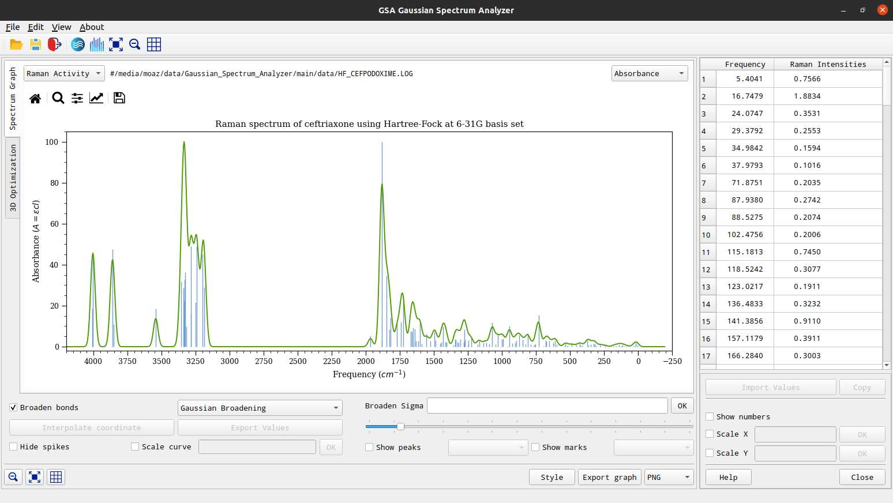

# Gaussian Spectrum Analyzer
Spectrum Analyzer or Gaussian Spectrum Analyzer is a GUI application used to visualize and create reports of the Gaussian View and Gaussian W calculations created in Python and Qt Library.

## Requirements
 - Qt 5
 - Python 3.7 or higher

## Install
```sh
$ pip install -r requirements.txt
```

## Run
```sh
$ python SpectrumAnalyzer.py
```

## Demo
### IR Spectrum


### Raman Spectrum


### 3D Render


## Info
You can install the compiled version if you are using windows os [Here](https://github.com/moaz-elesawey/gaussian-spectrum-analyzer/releases/tag/v1.0-alpha)